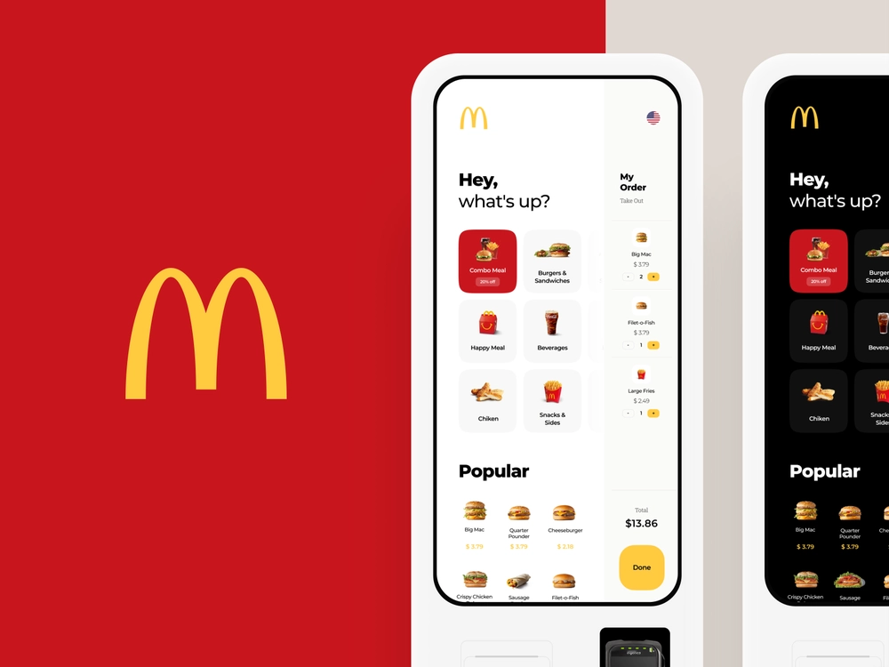

# Mobile Applications Development

This project demonstrates my academic qualifications in mobile application development.

My final project at the university was to create a list of players using Ionic 3.  Having developed  mobile applications in Ionic in the past, I chose another approach. 

This project mimics the [MacDonalds' Interface Concept](https://dribbble.com/shots/7049291-McDonald-s-Touch-Interface-Concept) using **React Native**.

## Indicative Knowledge

- GUI Development for Mobile Devices
- Persistent Data Storage
- Widgets and Services
- Location-aware Services and Mapping

## Requirements

