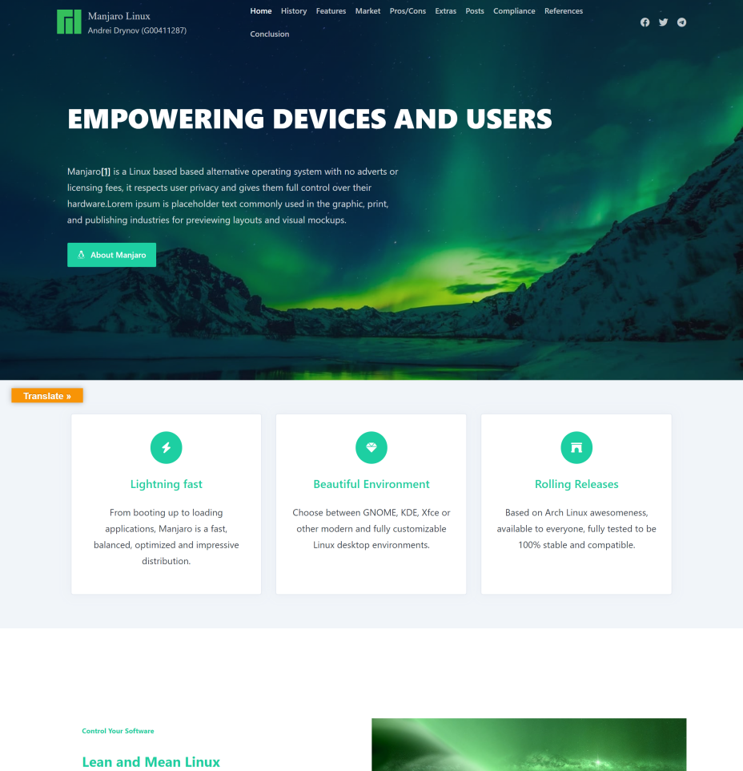

# Operating Systems and Cloud Computing

This project is a demonstration of my academic skills in cloud computing.

I was immersed in the fundamentals of Operating Systems and Cloud Computing (with a specific focus on virtualisation as a fundamental enabling technology for the Cloud).

I set up a WordPress web site on AWS using LAMP server in the following way:

- created an EC2 instance on AWS
- installed and configured Ubuntu Server 22.04
- installed and configured LAMP server
- installed and configured WordPress 6.1
- obtained a free domain **andreidrynov.tk** using <a href="https://www.freenom.com/">Freenom</a> World.
- created a static IP address using AWS Elastic IP address and redirected the domain
- installed and configured Let's Encrypt certbot
- created an SSL certificate and configured Apache HTTP server to use HTTPs
- installed and configured <a href="https://matomo.org/">Matomo </a> server, a powerful web analytics platform

I developed a web site that describes the pros and cons of running Manjaro Linux locally using a nice development tool <a href="https://localwp.com/">Local</a>. 

 I made a backup of the site and restored it to the WordPress instance running on AWS.

## Local Site

- LAMP server
- WordPress 6

Restore the provided **AndreiDrynov.wordpress** web site backup using [All-in-Onw WP Migration](https://wordpress.org/plugins/all-in-one-wp-migration/) Wordpress plugin

WordPress Admin Panel login:

| Username | Password |
|----------|----------|
| admin    | password |

## Licensing

This project is licensed under Unlicense license. This license does not require you to take the license with you to your
project.