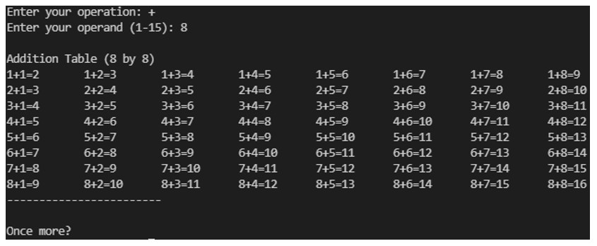

# Computer Architecture and Technology Convergence

This module's focus is in internal workings, structure, architecture and organisation of modern computer architectures.

## Indicative Knowledge

- Demonstrate an understanding of the components in modern computer architectures.
- Troubleshoot common computer hardware and software problems.
- Describe the topologies of computer networks.
- Explain the role of abstraction in the development of computer hardware and software

I created a small script that generates math tables. 

## Requirements

- Linux shell

Execute the script: `sh ./math_table_generator.sh`

The script prompts the user to enter a mathematical operation and the operand. It displays the Math Table corresponding to the operand being used:

## References

Recommend other interesting scripts:

- https://github.com/alexanderepstein/Bash-Snippets
- https://github.com/mertcangokgoz/UsefulBashScripts

