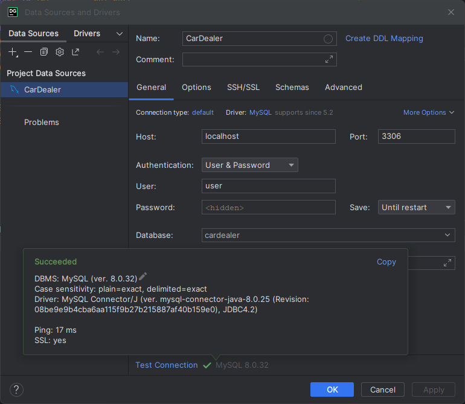

# Database Design and Development

This project showcases my academic qualifications in database design and development techniques.

## Indicative Knowledge

- Relational Database design - Primary Keys, Foreign Keys. Mapping ERD to a relational schema, data normalisation, relational integrity, keys, indexes; database transactions, ACID properties
- SQL: Schema definition: Create, Drop, Alter tables, views, sequences and indexes. Data manipulation in SQL: Insert, update and Delete tables and rows.
- SQL queries: basic queries, grouping, ordering, built-in SQL functions, joins, subqueries.
- Non-relational storage: Schema-less storage (no SQL); XML, Key Value and Document Store

## Projects

Tasks: 

1. Design a relational database schema for a software application
2. Devise a set of relational tables and develop a relational database.
3. Query a relational database using SQL
4. Evaluate the use of non-relational data storage technologies
5. <del>Prototype a non-relational database model</del> 

[Dental Practice](./DentalPractice/) - a relational database for a fictional dental practice.

[Car Dealership](./CarDealership/) -  a relational database for a car dealership (sample running under Docker)

## Requirements

- DBMS such as MySQL or MariaDB
- Docker

You can run MySQL DBMS using the Bitnami's Docker image: https://hub.docker.com/r/bitnami/mysql

Go to "Car Dealership" folder and execute to setup the MySQL database:

`docker-compose up`

Connect to the database using the credentials specified in the Docker Compose file: user / password



If something is wrong with the data, fully reset the database: 

`docker-compose down -v`

Alternatively, run MySQL server in a Docker container on Windows:

```bash
docker volume create mysql_data

docker run --name mysql -p 3306:3306 -e ALLOW_EMPTY_PASSWORD=yes  -e MYSQL_USER=user -e MYSQL_PASSWORD=password -e MYSQL_DATABASE=cardealer -e MYSQL_AUTHENTICATION_PLUGIN=mysql_native_password -v mysql_data:/bitnami/mysql/data bitnami/mysql:latest
```

Docker container on Linux:

```
docker volume create mysql_data

docker run -d --name mysql \
    -p 3306:3306 \
    -e ALLOW_EMPTY_PASSWORD=yes \
    -e MYSQL_USER=my_user -e MYSQL_PASSWORD=my_password \
    -e MYSQL_DATABASE=cardealer \
    -e MYSQL_AUTHENTICATION_PLUGIN=mysql_native_password \
    -v mysql_data:/bitnami/mysql/data \
    bitnami/mysql:latest
```
