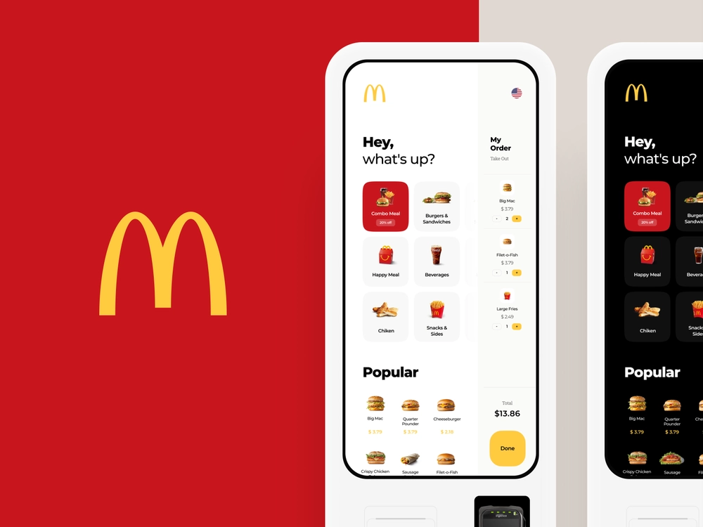

# Mobile Applications Development

This project demonstrates my academic qualifications in mobile application development.

My final project at the [University](https://atu.ie) was to create a list of players using Ionic 3. 

## Indicative Knowledge

- GUI Development for Mobile Devices
- Persistent Data Storage
- Widgets and Services
- Location-aware Services and Mapping

## Learning Objectives

After years of mobile application development in Ionic and native Android, I decided to give [React Native](http://reactnative.dev/) a try.

The project in this section mimics the [MacDonalds' Interface Concept](https://dribbble.com/shots/7049291-McDonald-s-Touch-Interface-Concept) using **React Native**.

I am learning React Native so the application only shows a bare front page at the moment.

- Learn UI basics
- Additional screens for product or category details
- Determine the best way to make API calls (axios?)
- Advanced

## Requirements

Setup the development environment to build and run React Native applications: http://reactnative.dev/docs/environment-setup

To start the application, execute `yarn expo start`

## 📝 Notes

- Find out more about using Expo: https://docs.expo.dev
- Learn more about [Universal React](https://docs.expo.io/)